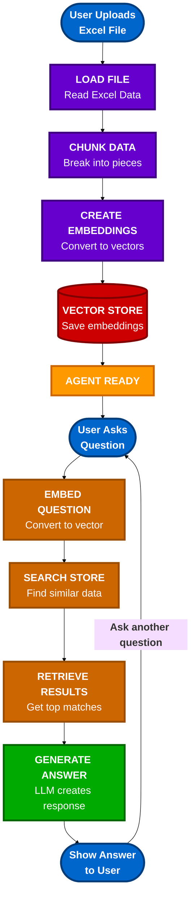

```mermaid
%%{init: {'theme':'base', 'themeVariables': { 'fontSize':'22px'}}}%%

graph TD
    START(["<b>User Uploads<br/>Excel File</b>"]) --> LOAD["<b>LOAD FILE</b><br/>Read Excel Data"]
    
    LOAD --> CHUNK["<b>CHUNK DATA</b><br/>Break into pieces"]
    
    CHUNK --> EMBED["<b>CREATE EMBEDDINGS</b><br/>Convert to vectors"]
    
    EMBED --> STORE[("<b>VECTOR STORE</b><br/>Save embeddings")]
    
    STORE --> READY["<b>AGENT READY</b>"]
    
    READY --> QUESTION(["<b>User Asks<br/>Question</b>"])
    
    QUESTION --> EMBED_Q["<b>EMBED QUESTION</b><br/>Convert to vector"]
    
    EMBED_Q --> SEARCH["<b>SEARCH STORE</b><br/>Find similar data"]
    
    SEARCH --> RETRIEVE["<b>RETRIEVE RESULTS</b><br/>Get top matches"]
    
    RETRIEVE --> GENERATE["<b>GENERATE ANSWER</b><br/>LLM creates response"]
    
    GENERATE --> ANSWER(["<b>Show Answer<br/>to User</b>"])
    
    ANSWER --> |"<b>Ask another question</b>"| QUESTION
    
    style START fill:#0066cc,stroke:#003d7a,stroke-width:4px,color:#ffffff
    style QUESTION fill:#0066cc,stroke:#003d7a,stroke-width:4px,color:#ffffff
    style ANSWER fill:#0066cc,stroke:#003d7a,stroke-width:4px,color:#ffffff
    style LOAD fill:#6600cc,stroke:#400080,stroke-width:4px,color:#ffffff
    style CHUNK fill:#6600cc,stroke:#400080,stroke-width:4px,color:#ffffff
    style EMBED fill:#6600cc,stroke:#400080,stroke-width:4px,color:#ffffff
    style STORE fill:#cc0000,stroke:#800000,stroke-width:4px,color:#ffffff
    style READY fill:#ff9900,stroke:#cc6600,stroke-width:4px,color:#ffffff
    style EMBED_Q fill:#cc6600,stroke:#994d00,stroke-width:4px,color:#ffffff
    style SEARCH fill:#cc6600,stroke:#994d00,stroke-width:4px,color:#ffffff
    style RETRIEVE fill:#cc6600,stroke:#994d00,stroke-width:4px,color:#ffffff
    style GENERATE fill:#00aa00,stroke:#006600,stroke-width:4px,color:#ffffff
```