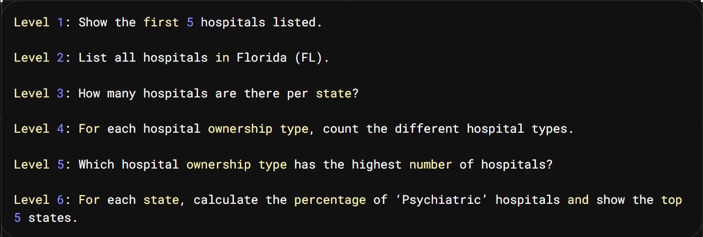

Level 1: Show the first 5 hospitals listed.

Level 2: List all hospitals in Florida (FL).

Level 3: How many hospitals are there per state?

Level 4: For each hospital ownership type, count the different hospital types.

Level 5: Which hospital ownership type has the highest number of hospitals?

Level 6: For each state, calculate the percentage of ‘Psychiatric’ hospitals and show the top 5 states.